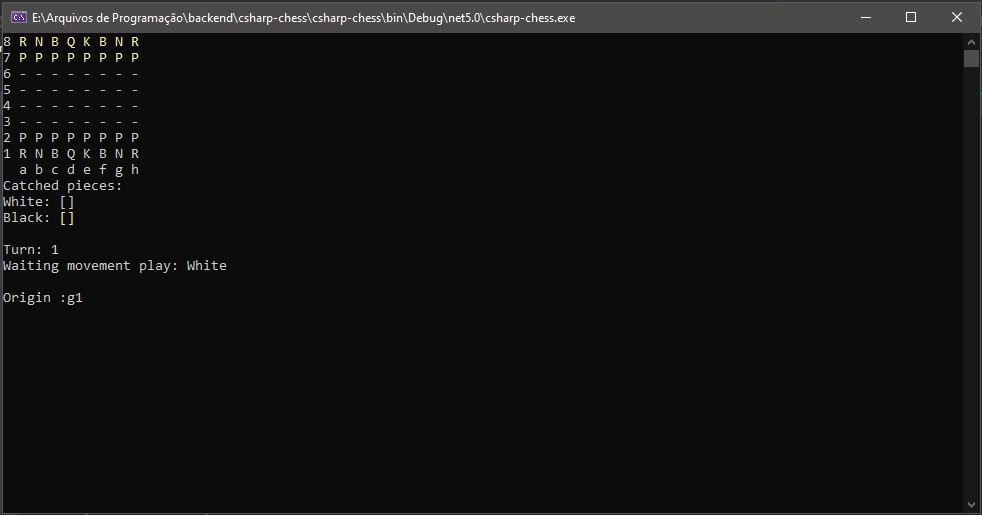
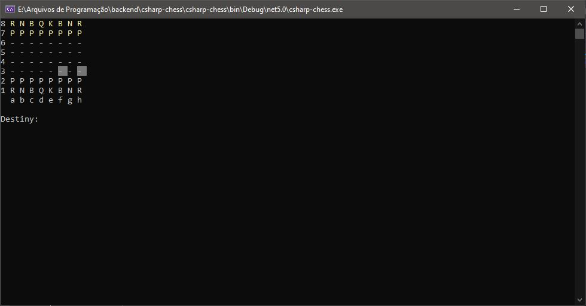
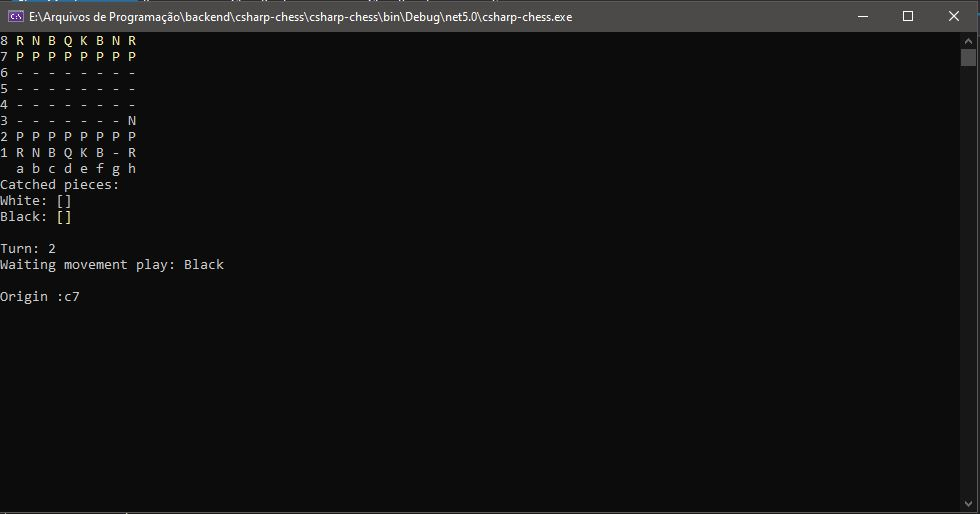
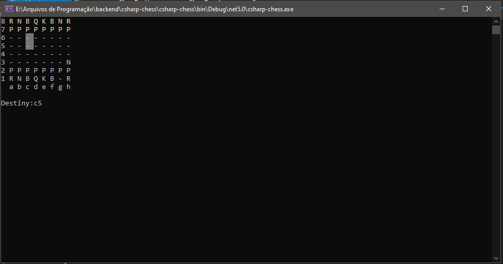

# C# - Console Chess Game

<h2>Hello ❕</h2>

<h3>➡️This project was developed using <strong>C#</strong> 🛠️</h3>

➡️Developed during C# OOP classes.

<h3>Images :chess_pawn:</h3>

</img>
 
</img>
 
</img>
 
</img>

 
<h3>Overview ⮯</h3>

This is a Chess game that you can play in your console, with all the code writted 100% in C#, to play it you just have to input the origin of the chesspiece based on the  square coordinate, and your output/destiny, that will be the square you want to move into.

<h3>How to run ⮯</h3>

** To run it, you just need to have VS installed !**

 
<em>'This project has no commercial purposes, it was carried out only for the application of my studies'📚</em>

<strong>----João Vítor Carvalho 👨‍💻 ---</strong>
